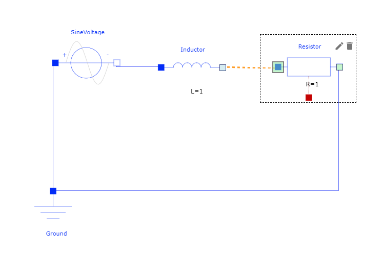
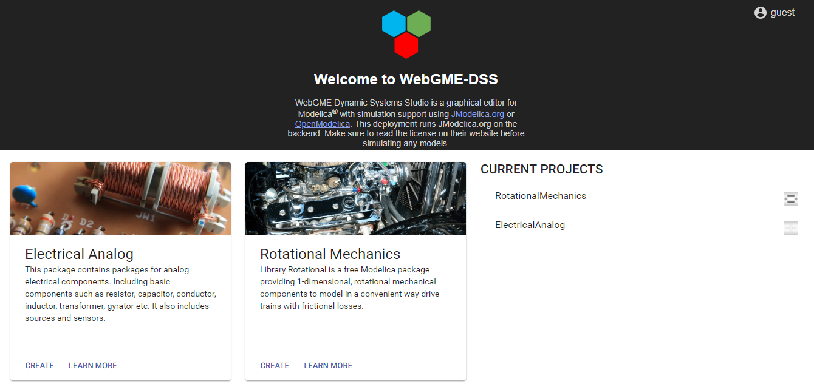
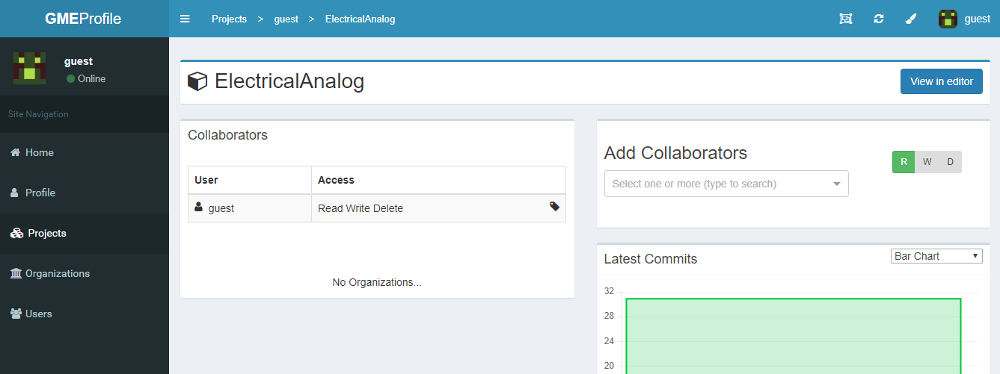
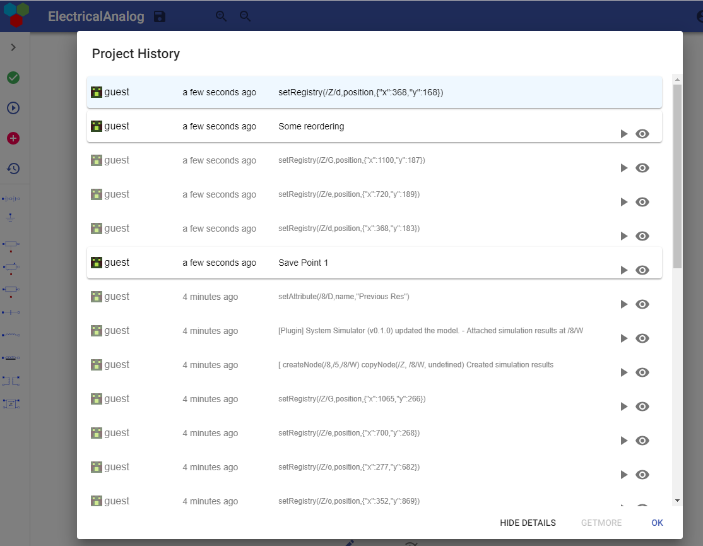
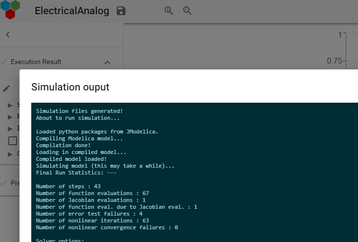
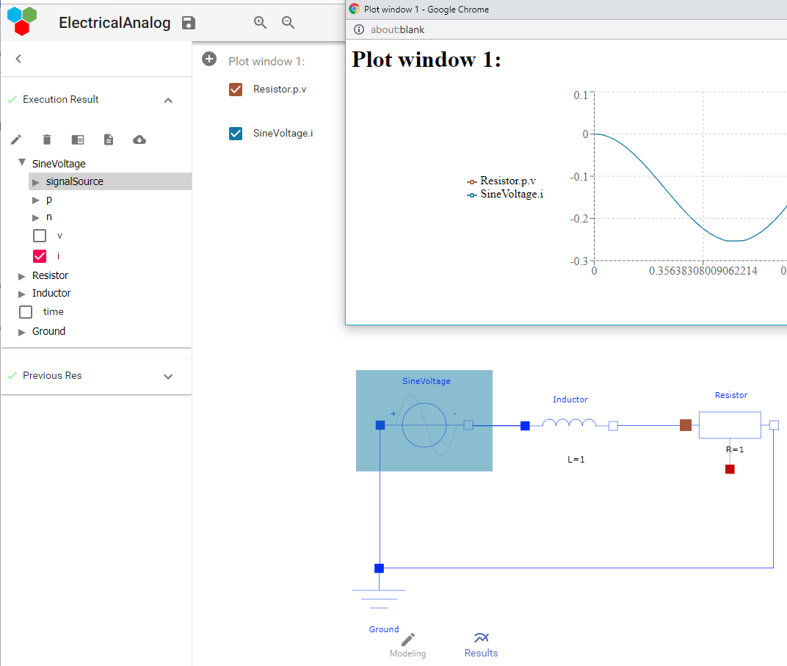
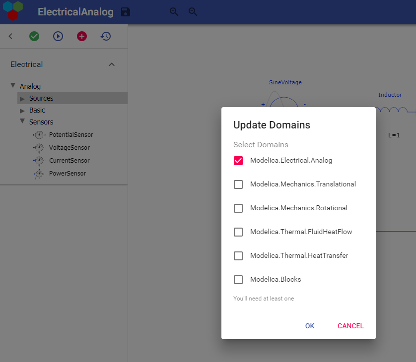

# WebGME-DSS
WebGME Dynamic Systems Studio is a web-based collaborative framework for
composing and simulating cyber-physical systems expressed as
[Modelica](https://www.modelica.org/) models. The framework is built on
top [WebGME](https://webgme.org) that provides a git-like centralized model storage where each
change is efficiently stored as commit inside a [mongodb database](https://www.mongodb.com/).

In the current stage it supports simulation of the Modelica models using
 either [JModelica.org](https://jmodelica.org/) or [OpenModelica](https://openmodelica.org/).

For more details about the application a paper was published under [Modelica on the Web](https://www.modelica.org/events/modelica2018Americas/preliminary-program/166522_Modelica_Proceedings_v2.pdf)
(page 220).

## Starting the application using docker-compose
With a single command (granted docker and docker-compose are installed)
you can try out the application with [JModelica.org](https://jmodelica.org/)
 as simulation backend.

Clone this repo:
```
git clone https://github.com/webgme/webgme-dss.git
```

Build images and start containers:
```
docker-compose up -d
```

Note that with the supplied compose files database files and artifacts are persisted
inside the containers, so launching a new container will wipe out the files.

## Some features
Leveraging the metamodeling capabilities of WebGME, the models are constrained to
only allow (and indicate to end-user) compatible constructs.



Each system constitutes a project which can be viewed as a repository.


In the same way authorization of git-repositories can be managed via github, webgme provides a
simple user management system with users and organizations.


Each state of the model can be retrieved at any time and versions can be compared.


Simulate the Modelica models using the stable open source tools [JModelica.org](https://jmodelica.org/) and/or [OpenModelica](https://openmodelica.org/).
As the simulation progress on the server the output is transmitted to the end-user via websockets.


For each simulation the simulation artifacts are stored inside the model repository together with
a snap-shot of the exact model that was simulated. This enables graphical feedback from the same context
the model was composed when viewing the time-series.


Only domains requested are loaded into the browser and can later on be updated from the user interface.


### Disclaimer
In its current state this application only supports a subset of Modelica in
terms of range of handpicked domains from [Modelica Standard Library](https://github.com/modelica/ModelicaStandardLibrary).
Modification of some parameter types such as `packages`, `maps`, `tables`, etc. are not supported.
The current support is however more than sufficient for getting familiar with the component-based
features of Modelica and to compose actual cyber-physical systems from the curated domains.

## Developers

#### Dependencies
To run the server application on a local machine first install nodejs and mongodb
 - For windows downloading the LTS from [nodejs.org](https://nodejs.org/en/) is a viable solution for linux [nvm](https://github.com/creationix/nvm) is recommended.
 - WebGME uses mongodb as model storage and works well with the [community-edition](https://www.mongodb.com/download-center#community).
 - In addition you'll need [git](https://git-scm.com/) to clone this repo and for installing some of the node_modules.

#### Build and start the application
##### Installing node_modules and building app
Clone this repo:
```
git clone https://github.com/webgme/webgme-dss.git
```

Next install the node_modules (defined as dependencies in `package.json`).
```
npm install
```

Secondly build the front-end application
```
npm run webpack
```

Start mongod locally at the default port (27017) by default the models will be put inside `multi` you can configure this
in `./config/config.default.js` which is the [configuration for webgme](https://github.com/webgme/webgme-engine/blob/master/config/README.md).

windows (example)
```
"C:\Program Files\<mongodb>\bin\mongod" --dbpath "C:\dirToStoreFiles"
```

linux/macOS
```
mongodb --dbpath <dirToStoreFiles>
```

With mongodb running start the webgme-server
```
npm start
```

It will print out the url (by default localhost:8888)

### Creating the Modelica Seed
 1. Follow the instructions in /scripts/py_modelica_exporter/README.md to generate `components.json`
 2. From `src/common/` run `node preprocessComponents.js` (it consumes `components.json` from step one)
    - If the PortMapping does not exist - the `ModelicaBaseSeed` and `metadata.json` need to be updated
 3. Create a project from the ModelicaBaseSeed name it e.g. `SeedProject`
 4. From root of repo run: `node node_modules\webgme-engine\src\bin\run_plugin.js SeedCreator SeedProject`
